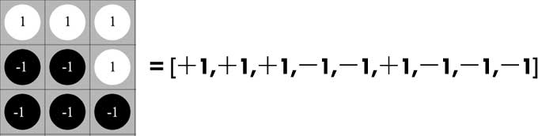
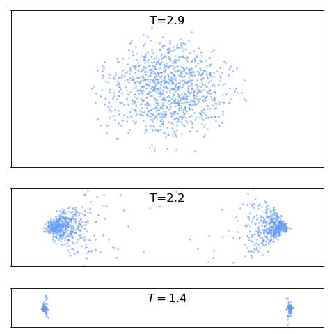
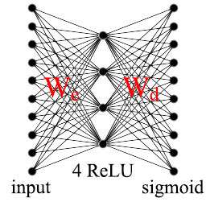
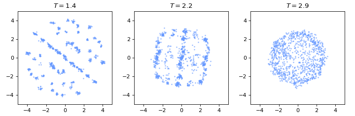

### Intro

In some sense, machine learning works like a "magic" to everybody.

For a real-world AI problem, such as classifying images, translating articles or playing games like AlphaGo, a learning machine demands thousands or millions of parameters to describe the complexity of the problem. Such a large number of parameters is a serious obstacle for our intuition or reasoning. 

Take neural networks for example. A neural network consist of many neurons. It's not difficult to understand the behavior of a single neuron, because the parameters of a single neuron is quite limited. However, the connectivity (or interaction) between the neurons make the neural network an indivisible entity, while our brains lack capacity to digest such a large chunk of parameters as a whole. Thus, even the parameters are tuned by the optimization algorithm we choose, such as minimizing KL-divergence by SGD (stochastic gradient descent), the neural network still seems like a "magic".

<!-- indivisible entity -->

This situation is also present in [many-body physics](https://en.wikipedia.org/wiki/Many-body_theory). It's usually not difficult to describe the dynamics of a single particle. However, tracking a large number of interactive particles is an impossible mission in physics. In fact, even a [three-body system](https://en.wikipedia.org/wiki/Three-body_problem), popularized by [a Chinese science fiction](https://en.wikipedia.org/wiki/The_Three-Body_Problem_(novel)), may exhibit a chaotic behavior, which makes tracking them very difficult. 

<figure>

</figure>

As [P. W. Anderson](https://en.wikipedia.org/wiki/Philip_Warren_Anderson) says ["*more is different*"](http://science.sciencemag.org/content/177/4047/393), though the interaction between a large number of elementary particles is a difficult intellectual challenge for the physicists, it is the fundamental reason for the amazing diversity of our universe. (If the particles has no mutual interaction, no highly organized system would exist, including our human body.) Similarly, the complicated connectivity between the neurons is responsible for the neural network to function properly, though it seems hopeless to get an intuitive feeling of so many "interactive" neurons. 

A good news from many-body physics is that, though it is impossible to track every particles of a system, we may understand the collective behaviors ( or macroscopic properties) of the system in a statistical way. Thus, if we could establish a clear connection between many-body physics and machine learning,  we may borrow weapons from physics to understand machine learning and vice versa. For this purpose, let's first look at the phase transition theory in physics. 

[Phase transition](https://en.wikipedia.org/wiki/Phase_transition) is perhaps the most important object of study in many-body physics, which is also closely related to other interdisciplinary research. In several recent papers [[1](#paper_ref1), [2](#paper_ref2), [3](#paper_ref3)], it is shown that machine learning methods can be used to discover phase transitions in physics. In contrast, this online paper works on a reverse scenario in some way. **Specifically, this article would like to visually give the evidence that "phase transition" is also present in the training of neural networks, and it is possible to identify the central concepts of phase transition theory, such as "symmetry breaking" or "critical point", in machine learning.**

### Basics of Statistic Physics and Ising Model

( This section means to be a cram course for those who have no physics background, though the terminology might be introduced quite casually. If some concepts are not explained in depth here, the readers are encouraged to visit the relevant links for more information. )

Phase transition theory is based on [statistical physics](https://en.wikipedia.org/wiki/Statistical_physics), of which the basic principle states that:

For a given system in thermal equilibrium with temperature $T$, the probability $p$ of its microscopic configuration $x$ is given by,

$$p(x) = {e^{-\beta H(x)}\over Z},\qquad \beta\equiv {1\over k_BT},\; Z\equiv\sum_{x^\prime} e^{-\beta H(x^\prime)}\ \label{eq1}$$

where $k_B$ is the Boltzmann constant, $H(\cdot)$ is the energy function, or called "Hamiltonian". $Z$ is a normalization factor, referred as "partition function", where the summation runs over all possible microscopic configurations.

Let's first look at the two limits of Eq. (\ref{eq1}):

* In high temperature limit $T\rightarrow +\infty$ (or $\beta\rightarrow 0^+$), the probability $p$ tends to be uniform for every configuration, which implies the  entropy of the system, defined by $s\equiv-\sum\limits_x p(x) \log p(x)$, is quite high in this case, and we say the system is in a "thermal disordered phase".

* At temperatures near zero temperature ($\beta\rightarrow +\infty$), the probability $p$ concentrates on the few configurations near the "[ground state](https://en.wikipedia.org/wiki/Ground_state)" (i.e., the lowest energy state). Consequently, the entropy is very small.

As an example, let's consider the famous [Ising model](https://en.wikipedia.org/wiki/Ising_model), which is an elementary model to describe ferromagnetic/anti-ferromagnetic phenomenon ( Ising model is also quite similar to ["Boltzmann machine"](https://en.wikipedia.org/wiki/Boltzmann_machine) in machine learning ). Its Hamiltonian is given by,

$$H=-J\sum\limits_{\langle ij\rangle}s_is_j\label{eq2}$$

where $J=\pm1$ is the coupling strength, $s_i\in \\{+1=\uparrow,-1=\downarrow \\} $ denotes the spin on site $i$ of a 2D square lattice. $\langle ij\rangle$ indicates a summation over nearest neighbors.  

For ferromagnetic Ising model ($J=1$), the configurations in which adjacent spins tend to be of the same sign have lower energy, thus dominate the system at low temperatures. Similarly, for anti-ferromagnetic Ising model ($J=-1$), the configurations in which adjacent spins tend to have the opposite sign dominate at low temperatures.

Though the ground state of ferromagnetic and anti-ferromagnetic Ising model are totally different, their thermodynamic properties are quite the same.  Notably, Ising model has an [exact solution](https://en.wikipedia.org/wiki/Ising_model#Onsager's_exact_solution) of "phase transition". If we consider a cooling process from above the "critical temperature" $T_c=2/\log(1+\sqrt{2})\approx2.25$ to below $T_c$, the Ising model changes from "thermal disordered phase" to the ordered "ferromagnetic phase" ($J=1$) or "anti-ferromagnetic phase" ($J=-1$), and the complexity of the system (measured by entropy) declines very fast. As demonstrated in Figure 1, the [exact solution](https://en.wikipedia.org/wiki/Ising_model#Onsager's_exact_solution) of the entropy as a function of the temperature is given by the red line, and the critical temperature $T_c\approx 2.25$ can be identified by the [inflection point](https://en.wikipedia.org/wiki/Inflection_point) of the line. ( The blue line will be explained in the next section. ) 

<figure>

<figcaption>Figure 1: The entropy (red line) and the 3d PCA loss (blue line) of the Ising lattice as a function of temperature</figcaption>
</figure>

### Principal Component Analysis of Ising model 

At each temperature of Figure 1,  we may generate samples of spin configuration by [Monte Carlo methods](https://en.wikipedia.org/wiki/Metropolis%E2%80%93Hastings_algorithm) (MC) with the probability distribution defined by Eq.(\ref{eq1}). In the following, we focus on the anti-ferromagnetic Ising model ($J=-1$), of which the low temperature phase shows a checkerboard pattern which seems a bit more interesting than the ferromagnetic case.

Figure 2 gives three typical sample results for $T=1.4<T_c$, $T=2.2\approx T_c$ and $T=2.9>T_c$ on a $16\times16$ square lattice after 1000 Monte Carlo steps. The white/black dots denote the site where the spin $s=1 (\uparrow)$ and $s=-1 (\downarrow)$ respectively. It's easy to see that the sample of low temperature phase ($T=1.4<T_c$) is much more ordered than that of high temperature phase ($T=2.9>T_c$), consistent with the fact that the entropy at $T=1.4$ is much smaller than $T=2.9$.
 
<figure>

	

	

	

<figcaption>Figure 2: Monte Carlo sample of anti-ferromagnetic Ising model as different temperatures. (Press the refresh button to generate some new samples by Metropolis algorithm.)</figcaption>
</figure>

In physics, The "degree of order" is formally described by [order parameter](https://en.wikipedia.org/wiki/Phase_transition#Order_parameters), which has a finite value in the "ordered phase" and vanishes in the "disordered phase".

Strictly speaking, the vanishing of the order parameter in "disordered phase" only happens in the [thermodynamic limit](https://en.wikipedia.org/wiki/Thermodynamic_limit) when thermal fluctuations are absent.

As pointed out by the papers[[1](#paper_ref1), [2](#paper_ref2), [3](#paper_ref3)], __"order parameter" in physics is conceptually equivalent to the low-dimensional embedding of the samples in PCA ([principal component analysis](https://en.wikipedia.org/wiki/Principal_component_analysis)) or some other [dimensionality reduction](https://en.wikipedia.org/wiki/Dimensionality_reduction) techniques.__

 An excellent introduction to dimensionality reduction can also be found here [http://colah.github.io/posts/2014-10-Visualizing-MNIST/](http://colah.github.io/posts/2014-10-Visualizing-MNIST/)

Next we choose PCA to visualize the spin configurations. ( Compared with other dimensionality reduction algorithms, PCA is more straightforward, less stochastic, and good enough for our purpose. ) First, we represent every spin configuration by a row vector, for example,

For the $16\times16$ lattice, every spin configuration is represented by a $16\times16=256$ dimensional vector. We generate 1000 independent samples by MC algorithm at a specified temperature, such as, $T=1.4$. The row vectors of these samples can be stacked into a $1000\times256$ dimensional matrix $X$. After we have the data matrix $X$, the "principal components" of the samples can be directly computed by tools, such as [scikit-learn](http://scikit-learn.org/stable/modules/generated/sklearn.decomposition.PCA.html) or [fbpca](http://fbpca.readthedocs.io/en/latest/). For completeness sake, We also briefly give the mathematical basis below:

> In PCA, the eigenvalue equation of the "covariance matrix" $M\equiv X^TX$ is given by,
>
> $$Mv_i=\lambda_iv_i$$
>
> where $\\{\lambda_1\ge\lambda_2\ge\lambda_3\ge\cdots\\}$ are the sorted eigenvalues in a descending order, $\\{v_1,v_2,v_3,\cdots\\}$ are the normalized eigenvectors. The projected component $i$ of the samples is given by,
>
> $$y_i=Xv_i$$

Figure 3 gives the two-dimensional PCA representation of the samples at $T=1.4<T_c$, $T=2.2\approx T_c$, and $T=2.9>T_c$ respectively. The horizonal axis denotes the first "principal component", while the vertical axis denotes the second. At high temperature ($T=2.9>T_c$), we see that the samples all stay in a single "cloud" of points near the origin. At low temperature ($T=1.4<T_c$), the sample points polarize into two pieces of "cloud". In this case, every single sample seems to face a "hard decision". It has to choose only one of the clouds to support, the left piece or the right piece ( not both ). In other words, for every single sample, the choice of spin configuration is now "[symmetry breaking](https://en.wikipedia.org/wiki/Symmetry_breaking)". 

<figure>
	
	<figcaption>Figure 3: two-dimensional PCA representation of the samples at different temperatures</figcaption>
</figure>

Figure 4 gives the three-dimensional PCA representation of the samples at different temperatures, where the red, green and blue line denote the axis for the first, second and third principal component respectively. You may zoom or rotate the 3D scene to visualize the sample points more closely. 

<figure>

<figcaption>Figure 4: three-dimensional PCA representation of the samples at different temperatures</figcaption>
</figure>

Apart from visualization or clustering analysis, PCA can also be regarded as a method of [data compression](http://facepress.net/pdf/736.pdf), and its "information loss" can be measured by the "variance ratio [[1](#paper_ref1)]" $r\in[0, 1]$ defined by,

$$ r\equiv 1 - {\sum\limits_{i\le k}\lambda_i\over \sum\limits_i\lambda_i}={\sum\limits_{i\gt k}\lambda_i\over \sum\limits_i\lambda_i} \label{eq5}$$

where $\\{\lambda_1,\lambda_2,\cdots\lambda_k\\}$ are the eigenvalue of the components we keep in the PCA representation, and the denominator is a summation of all eigenvalues. (When $r=0$ the original data can be reconstructed perfectly from the components we keep, otherwise the compression is lossy.)

As pointed out by the papers [[1](#paper_ref1), [2](#paper_ref2), [3](#paper_ref3)], the information loss $r$ (or "reconstruction loss") can also be used to identify the phase transition. As demonstrated in Figure 1, the blue line gives the information loss of the three-dimensional PCA representation as a function of temperature, which has a shape similar to the entropy. Thus, if the entropy is unavailable,  we may also identify the "critical point" of the temperature $T_c$ by the inflection point of the information loss.    

### Phase transition of the "Learning Machine"

After discussing the concepts such as "phase transition" and "symmetry breaking" in physics, next we would like to introduce these concepts into machine learning. For this purpose, let's look at a simple autoencoder. As shown in Figure 5, the autoencoder has only one single hidden layer with 4 ReLU units. 

<figure>

<figcaption>
	Figure 5: the structure of our autoencoder. $W_e$ and $W_d$ denote the encoding and decoding weights respectively.
</figcaption>
</figure>

> More specifically, the output of the autoencoder is defined by,
>
> $$\begin{eqnarray} 
h \equiv& \mathop{relu}(xW_e + b_e)      \nonumber \\
y \equiv& \mathop{sigmoid}(hW_d + b_d)\label{eq6}
\end{eqnarray}$$
>
> where $x$ denotes the input, $y$ denotes the reconstruction output. $W_e$ and $b_e$ are the encoding weights and bias, $W_d$ and $b_d$ are the decoding weights and bias. This autoencoder will be trained by minimizing the cross-entropy between $x$ and $y$.

Now we take the spin configurations of Ising lattice as the training data. Compared with other datasets, such as [MNIST](https://en.wikipedia.org/wiki/MNIST_database), the advantage of employing spin configurations is that, the data distribution defined by Eq.(\ref{eq1}) is explicitly known to us, and we aim to study how the autoencoder itself changes, as we tune the data distribution ( by varying the temperature in Eq.(\ref{eq1}) ). 

Actually the spin configurations of Ising model is equivalent to a grayscale image database (just like MNIST), since every spin $s\in\\{-1, 1\\}$ can be mapped into a pixel value $\sigma\equiv (1+s)/2\in\\{0, 1\\}$. Following this convention, every spin configuration will be represented by a 256 dimensional vector with every slot be 0 or 1, and the sigmoid output of the autoencoder ensures every predicted pixel value lies between 0 and 1.

The basic idea is that, a "learning machine" (such as the autoencoder) is optimized to describe the data received. Thus, if the data is highly "ordered", the "learning machine" should be somehow highly organized as well, and vice versa. In other words, there should be some **"ordering duality"** between the "learning machine" and the data. To explore this idea, we need to measure the complexity of the autoencoder first. 

An important observation is that, for a given dataset, the optimized parameters of a "learning machine" is usually far from unique, and we should generate quite a number of optimized "parameter configurations" by training algorithm, just like we generate the  spin configurations by Monte Carlo algorithm. 

More specifically, for a given temperature, such as $T=1.4$, we generate 2000 independent spin configurations as the training set, and generate another 1000 spin configurations as the validation set. The parameters of the autoencoder is initialized from a uniform distribution, and we train the autoencoder by minimizing the cross-entropy ( between the input and the output defined by Eq(\ref{eq6}) ) until the validation loss doesn't improve any more. In this way, we generate 1000 optimized "parameter configurations" at each of temperatures $T=1.4, 1.5, \cdots 2.8, 2.9$.

 Just like we describe the spin configuration of Ising model by a row vector, we may represent every "parameter configuration" by 4 vectors according to their roles in the autoencoder, i.e., a $4$ dimensional vector $\vec{b}_e$ for the encoding bias, a $256$ dimensional vector $\vec{b}_d$ for the decoding bias, a $256\times4=1024$ dimensional vector $\vec{W}_e$ for the encoding weights and a $1024$ dimensional vector $\vec{W}_d$ for the decoding weights.

To simplify our discussion, next we focus on analyzing the decoding weights $\vec{W}_d$. At each temperature, the decoding weights $\vec{W}_d$ of the 1000 generated "parameter configuration", can be stacked into a $1000\times1024$ matrix $\mathcal{M}$. Similar to the previous section, we are now ready to carry out an principal component analysis.

Figure 6 gives the two-dimensional PCA representation of the decoding weights trained by the spin configurations at $T=1.4<T_c$, $T=2.2\approx T_c$, and $T=2.9>T_c$ respectively. It is easy see that the decoding weights $W_d$ trained at low temperature ($T=1.4$) are much more organized than those trained at high temperature ($T=2.9$). ( We may also visualize other parameters like $W_e$ by the same procedure, and we would get similar ordering behavior. ) **Thus, we get a visual evidence that the autoencoder trained at low temperature is much more organized than that trained at high temperature.__

<figure>
	
	<figcaption>Figure 6: two-dimensional PCA representation of the parameter $W_d$ at different temperatures.</figcaption>
</figure>

Figure 7 extends the PCA representation of the decoding weights $W_d$ to three dimension, in which we also visualize its training history, i.e., the PCA representation of $W_d$ at different training epochs. The red, green and blue line denotes the axis for the first, second and third principal component respectively. ( You may zoom or rotate the 3D scene to visualize the points more closely. )
In particular, the optimized parameters at $T=1.4$ or $T=2.2$ exhibit an interesting 3d structure, which could be probably described by some [symmetry group](https://en.wikipedia.org/wiki/Symmetry_group). This Figure also visualizes how the training algorithm drive the parameters from the random initial state to an organized final state. 

<figure>
	

	<figcaption>Figure 7: The training history of the parameter $W_d$ at different temperatures, visualized by three-dimensional PCA.</figcaption>
</figure>

Next, we would like to show that, the varying in the degree of  order (as shown in Figure 6) can be explained as a "phase transition" with no difficulty. We may prove this issue straightforwardly by computing the entropy of the "parameter configurations" as a function of temperature. The "critical point" of the temperature, as shown in Figure 1, can be identified by the flex of the entropy curve, but it is not quite easy to calculate the entropy directly, because the model parameters are both continuous and high dimensional. Fortunately, as mentioned in the previous section, the "critical temperature" can also be identified by the inflection point of the "information loss" defined by Eq.(\ref{eq5}), which is quite easy to obtain.

The left panel of Figure 8 shows the information loss as a function of temperature, in which we can find a clear inflection point indicating the critical temperature $T_c^\text{(model)}$ of the phase transition. Interestingly, (but might not surprisingly), **$T_c^\text{(model)}$ is quite close to the critical temperature $T_c$ of the Ising lattice which generates the inputing data samples. This coincidence formalize idea of "ordering duality" between the inputing data and the learning machine.**

For completeness sake, we also give the training history of the information loss in the right panel of Figure 8,  of which the last frame is the same as the left panel.

<figure>

	

	
	

	

	<figcaption>Figure 8: left panel gives the 3d PCA loss of the optimized "parameter configurations" as a function of temperature. Right panel shows the training history of the PCA loss, of which the last frame is the same as the left panel.</figcaption>
</figure>

As illustrated above, **every central concepts of the phase transition theory in many-body physics can be found in machine learning. In particular, the PCA representation of the model as shown in Figure 6 and Figure 7 has the same role as the "order parameter" in physics, which shows some "symmetry breaking" behavior.**

### Reconstructing MNIST Dataset

To highlight the existence of phase transition in machine learning, the previous study is more or less related to physics. In this section, we focus on the [MNIST dataset](https://en.wikipedia.org/wiki/MNIST_database), which has nothing to do with physics. Though the explicit distribution of MNIST is unavailable (not like Ising model) and there is no naturally tunable parameter like the temperature in Eq.(\ref{eq1}), there also exists "symmetry breaking" phenomenon in the context of MNIST dataset.  

For comparison, we still use the same autoencoder as shown in Figure 5, except the input size is now $28\times28=784$ to match the MNSIT sample, and we still take 2000 training samples uniformly sampled from the digits of MNIST. The training is early stopped after the valid loss doesn't improve any more. Considering the fact that the autoencoder has only 4 hidden units, which  limits its fitting capacity seriously, we only choose 4 digits, i.e. 0-1-2-3, as the inputing data in our experiment.

By the same procedures explained in previous section, we carry out an PCA visualization of the decoding weights $W_d$ as an example. The result is given by Figures 9, which visualizes the training history of the decoding weights $W_d$, and this points transforms from a initial "random cloud" into a final tetrahedron structure. In some sense, the forming of this structure can be considered as a "symmetry breaking" phenomenon in physics. The top-right corner of this figure visualizes some reconstruction results of the validation data at each training epoch. The final reconstruction result for 4-5-6-7-8-9 is unfaithful, since the autoencoder is trained only by the digit samples of 0-1-2-3 (500 samples per each digit).  

<fiugre>

<figcaption>Figure 9: a history visualization of $W_d$ by three-dimensional PCA representation. The autoencoder is trained only by the digit samples of 0-1-2-3.</figcaption>
</fiugre>

For completeness sake, we also give a visualization when the autoencoder is trained by all the digit samples 0-1-2-3-4-5-6-7-8-9 (200 samples per each digit) as shown in Figure 10. Compared with Figure 9, the final structure of the points has some shape between a tetrahedron and a sphere. 

<fiugre>

<figcaption>Figure 10: a history visualization of $W_d$ by three-dimensional PCA representation. Compared with Figure 9, the autoencoder is trained by all the digit samples of 0-1-2-3-4-5-6-7-8-9.</figcaption>
</fiugre>

**In some sense, the forming of the structure in the training process as shown in Figure 9 and Figure 10 can be considered as a "symmetry breaking" phenomenon in phase transition theory.**

### Conclusion

This online paper visually illustrate the connection between the phase transition theory in physics and machine learning. Conceptually, it formalize the idea of "ordering duality" between the "learning machine" and the inputing data. 

The implication of this study for our everyday life is that we should be careful about choosing the environment we stay or the subject we learn, because our brains are just like the "learning machine", if the outside world is poorly organized, our inner mind might be messed up as well. :-)

### References

<a id="paper_ref1">[1]</a> [Wang L. (2016). Discovering phase transitions with unsupervised learning. Physical Review B, 94(19), 195105.](https://arxiv.org/abs/1606.00318)

<a id="paper_ref2">[2]</a> [Kun Huang (2017). Connecting phase transition theory with unsupervised learning. arXiv preprint arXiv:1712.05704v1.](https://arxiv.org/abs/1712.05704)

<a id="paper_ref3">[3]</a> [Wetzel, S. J. (2017). Unsupervised learning of phase transitions: from principle component analysis to variational autoencoders. arXiv preprint arXiv:1703.02435.](https://arxiv.org/abs/1703.02435)

( I would be glad to hear your comments. If you find typos or something which needs more clarification, you are encouraged to make a pull request on github or just <a href="mailto:kunhuang@connect.hku.hk">leave me a message</a>. This online paper is powered by [Jekyll](https://jekyllrb.com/) and several great Javascript libraries, including [React.js](https://reactjs.org/), [Three.js](https://threejs.org/), [D3.js](https://d3js.org/) and [MathJax](https://www.mathjax.org/). Many thanks to those who contributed to these libraries. )

