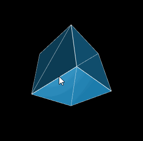
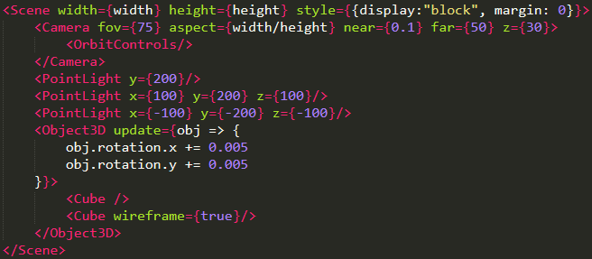

## 一、 背景简介

#### Threejs

Threejs 是一个非常流行 Javascript 3d 引擎，我们可以在[Threejs官网](https://threejs.org/)找到非常多酷炫的3d案例。 对于开发者而言，Threejs 对 webGL 优雅的封装让我们可以用面向对象的思路进行3d建模。 其特点可以概括为：

1. Threejs 对webGL的底层调用进行了封装，专注于3d模型的绘制
2. Threejs 中的3d模型具有简单的“组件化” 结构（类似sketchup中的group），通过其基础类 Object3D 的 add 方法来实现 

#### React

React 是一个非常灵活高效的模块化前端框架。 下面是一些React的主要特点：

1. 我们可以使用类似xml声明的方式非常直观地引入模块，同时表达模块之间的依赖嵌套关系
2. 我们可以通过注入方法，例如component­Did­Mount、component­Will­Unmount等，严格管理各模块组件的状态和生命周期
3. React的数据传播具有单向流的特点，因此我们可以配合Redux等轻量模块，完整实现前端的Flux开发模式

这些特点对于组织复杂应用都是非常重要的。

#### “中间件”

对于复杂的3d应用场景，我们一方面需要Threejs专业的3d绘制能力，同时我们也需要React普适的模块组织能力，尤其是当canvas 3d场景和其他DOM元素有耦合关系的时候。

由于Threejs 和 React都是“框架型”js库（区别于“工具型”js库，如jquery, underscore），即开发者使用它们时，代码需要服从某种既定的大致结构。因此，怎样系统地将二者有机组合起来使用，并不是一件显而易见的事情。 

本文将试图创造一个js “中间件”，用来连接 Threejs 和 React。 由于 Threejs 和 React 作为“重型”js库，各自已有足够多的“轮子”和“锁链”，我们希望这个“中间件” 是轻量的，即我们希望这个“中间件”对原有框架的底层和使用习惯不做任何改变，同时也尽量避免重复造轮子，因为我们希望使用这个“中间件”时，不会引入其他的复杂性或学习成本。

这里先预览一下采用“中间件”实现的一个最终demo：

这个demo，对应的核心代码是

相信对于熟悉Threejs的开发者，这段jsx片段的含义是非常直观的。

[Demo](https://hku.github.io/articles/thrones) 是用该“中间件”实现的一个更复杂的案例。

## 二、 Threejs的组件化

联结 Threejs 和 React 的首要问题是怎样实现Threejs中对象的“组件化”， 前面我们提到 Threejs 中也可以通过Object3D的add方法实现简单的“组件化”结构，例如要绘制一个“行星系统”， Threejs中通常可以这样写

但是这种 “组件化” 和 React的组件不是一个体系，即无法像jsx那样用xml声明的形式更加直观地描述组件之间的嵌套与参数依赖关系，同时threejs的“组件”也缺少对其状态的描述和对其生命周期的管理，例如我们希望当某个3d模型被创建时，该模型可以被自动add进来，当不需要该模型时，我们希望该模型可以“自动”被remove掉。 这些在React 组件中是可以轻易实现的，因此我们首先构造一个 Three.Object3D 在React中的“代理”组件，它有一个obj属性，对应其被代理的Threejs.Object3D 实例。当该组件被“创建时” (component­Did­Mount)，其被代理的obj 立刻被add 到其父组件代理的obj，同样当该组件被“销毁”时，该组件代理的obj自动从父组件代理的obj中被remove掉，具体代码如下：

以后当我们需要创建一个3D对象的时候，我们只需要继承这个基础类，例如：

注意：这里我们创造Cube对象时，没有重新创造 material 或者 geometry 对应的React 组件，因为material 和geometry 是描述 Object3D 的，自身并没有模块化特征，因此没有必要为了“React化” 而 “React 化”。 相反，这里认为，直接在 objContructor方法内用js代码的方式创建 obj 是自然的，因为这样最大程度上保留了threejs开发者以前的代码习惯（只在需要的时候才“React化”），threejs开发者可以像以前一样在这个方法内专注于3d模型的定义。

（未完）

